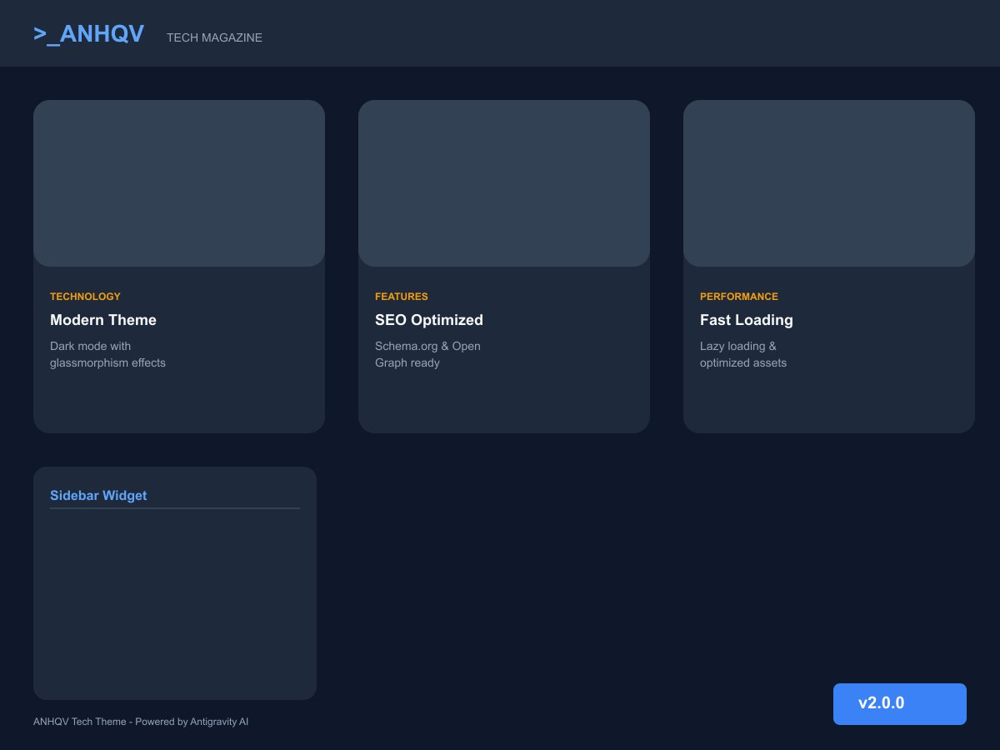

# ANHQV Tech - WordPress Theme v2.0.0



**ANHQV Tech** es un tema de WordPress moderno, minimalista y de alto rendimiento, diseñado específicamente para blogs de tecnología, revistas digitales y creadores de contenido que buscan una estética futurista y premium.

## 🚀 Características Principales

### 🎨 Diseño y Estética
- **Modo Oscuro Nativo**: Interfaz optimizada para reducir la fatiga visual con una paleta de colores Slate profundamente elegante.
- **Glassmorphism**: Efectos de desenfoque y transparencias modernas que dan profundidad a la interfaz.
- **Tipografía Premium**: Uso de Google Fonts (*Outfit* para títulos y *Inter* para cuerpo) que garantiza legibilidad y estilo.
- **Micro-interacciones**: Animaciones suaves al pasar el ratón (hover) y transiciones fluidas.
- **100% Responsive**: Experiencia optimizada para móviles, tablets y escritorio.

### 🛠️ Funcionalidades Técnicas
- **SEO Ready**: Optimizado con etiquetas Meta, Open Graph (OG) y marcado Schema.org (JSON-LD) para mejor indexación.
- **Velocidad de Carga**: Implementación nativa de Lazy Loading y pre-conexión a recursos externos.
- **Breadcrumbs Integrados**: Sistema de migas de pan nativo para mejorar la navegación y el SEO.
- **Tiempo de Lectura**: Cálculo automático del tiempo estimado de lectura en cada post.
- **Social Sharing**: Botones de compartir en Twitter, Facebook, LinkedIn y WhatsApp integrados sin plugins externos.

### 📰 Gestión de Contenido
- **Posts Relacionados**: Algoritmo por categorías para fomentar la navegación interna.
- **Widgets Personalizados**: Áreas específicas para publicidad (AdSense/Amazon) antes y después del contenido.
- **Navegación Inteligente**: Header pegajoso (sticky) y menú de navegación footer.
- **Optimización de Imágenes**: Tamaños personalizados (16:9 para destacados) que ahorran ancho de banda.

## 🛠️ Tecnologías Utilizadas
- **Core**: PHP (WordPress Standards)
- **Styling**: Vanilla CSS (Variables CSS/Custom Properties)
- **Interacción**: Vanilla JavaScript
- **Fuentes**: Google Fonts API

## 📦 Instalación

1. Descarga el repositorio o clónalo en tu carpeta de temas:
   ```bash
   cd wp-content/themes/
   git clone https://github.com/unpokitodxfavor/anhqv-tech.git
   ```
2. Accede a tu panel de administración de WordPress.
3. Ve a **Apariencia > Temas**.
4. Busca **ANHQV Tech** y haz clic en **Activar**.

## ⚙️ Configuración Recomendada

- **Menús**: Configura tu menú principal en la ubicación "Primary Menu".
- **Widgets**: Añade tus códigos de publicidad en las áreas "Ad: Before Content" y "Ad: After Content" para maximizar ingresos.
- **Imagen Destacada**: Se recomienda usar imágenes con una relación de aspecto 16:9 para obtener los mejores resultados visuales.

---
Desarrollado con ❤️ por [Unpokitodxfavor](https://aquinohayquienviva.es)
